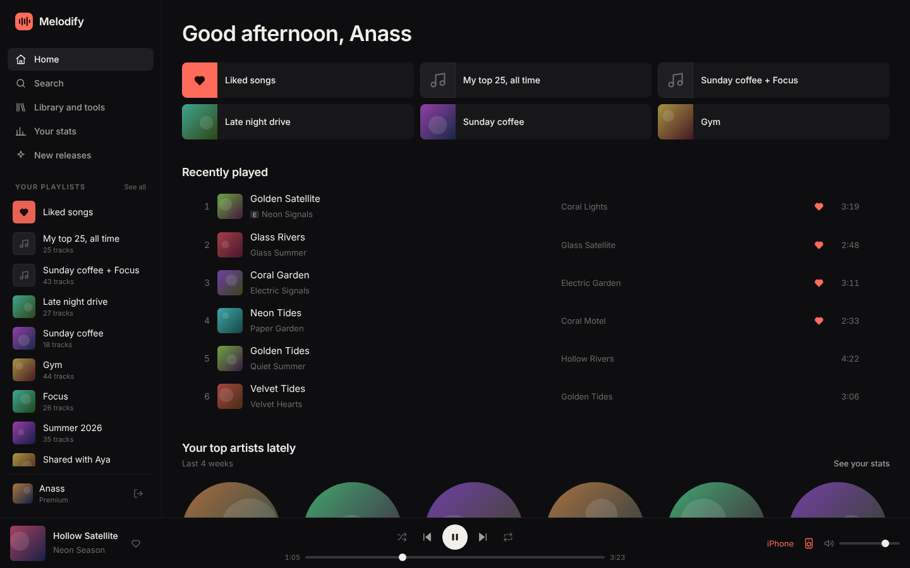
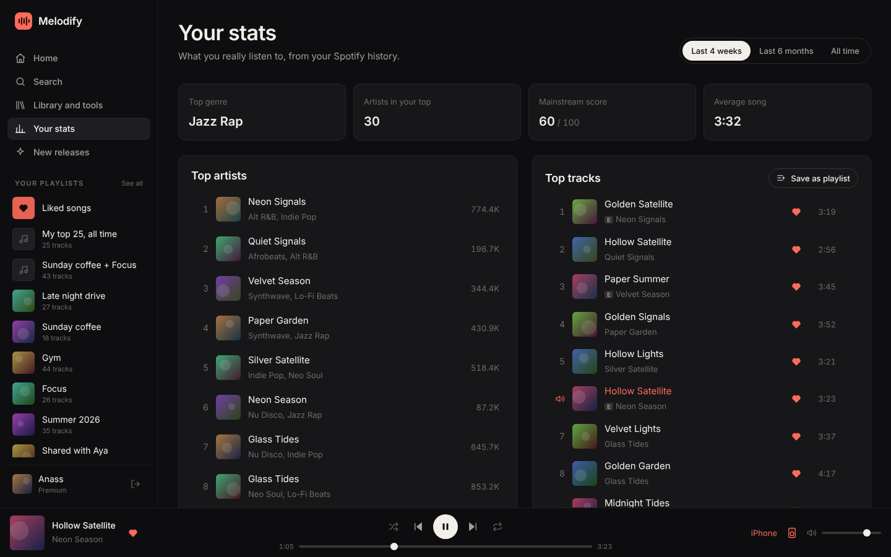
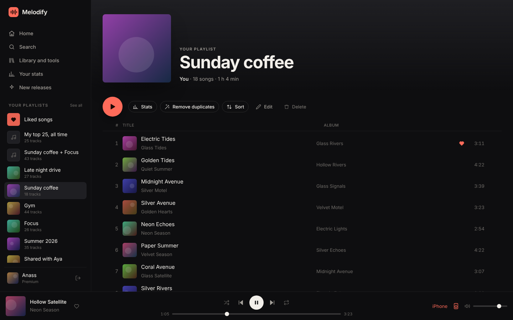
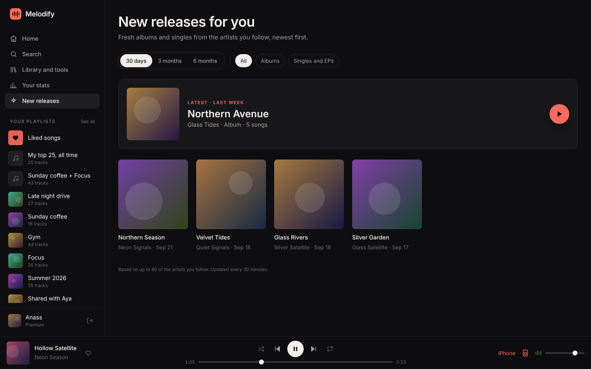
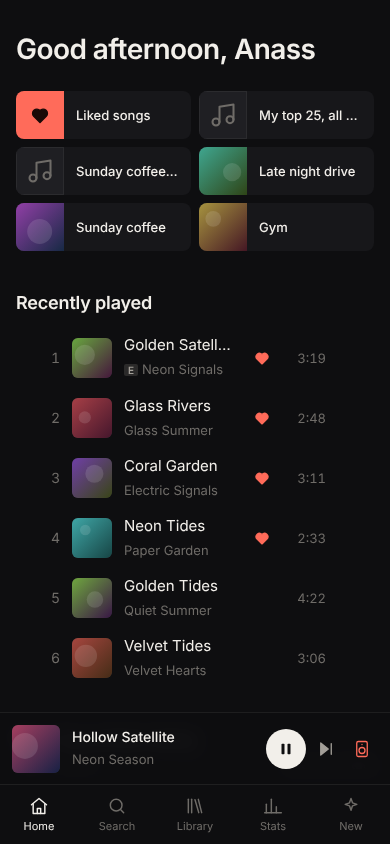

# Melodify

Melodify is a companion app for your Spotify account. It shows what you really listen to, cleans up your playlists, collects new releases from the artists you follow and lets you control playback on any of your devices.

Live: https://melodify.anasserekysy.com



## Features

**Listening stats.** Top artists and tracks for the last 4 weeks, 6 months or all time, top genres, release decades, a "mainstream score" and a 24-hour chart of when you listen (from your last 50 plays, in your local time). Every chart has a table view. One click saves your top tracks as a playlist.



**Player and devices.** A player bar on every page (play, pause, skip, seek, volume, shuffle, repeat) that drives Spotify Connect. Pick any device from the device menu, or "Play in this browser" with the Spotify Web Playback SDK. Playing needs Spotify Premium.

**Playlist tools.** Remove duplicates (same song id, or same title and main artist), sort a playlist by artist, title, release date, popularity, length or date added, merge several playlists into a new one, and build a playlist from your top tracks. Each playlist also has a stats panel (length, popularity, explicit share, top artists, decades, duplicates).



**New releases for you.** Albums and singles released in the last 30 days, 3 months or 6 months by the artists you follow, newest first.



Plus: search, liked songs, artist pages (follow, popular tracks, discography), album pages, add to queue, add to playlist, and a mobile layout with bottom tabs.



## Stack

| Part | Tech |
| --- | --- |
| Client | Angular 19 (standalone components, signals), Tailwind CSS 3, Inter. Design notes in [client/DESIGN.md](client/DESIGN.md) |
| API | .NET 8 minimal APIs, no NuGet packages: typed Spotify Web API client, token refresh, in-memory cache for releases |
| Tests | xUnit (domain logic + API rules), Playwright end-to-end tests with a mocked API |
| Delivery | One Docker image (the API serves the Angular build), GitHub Actions to GHCR, deployed to an OVH VM behind Nginx. See [DEPLOYMENT.md](DEPLOYMENT.md) |

```
client/                 Angular app (src/app/pages, shared, core)
client/e2e/             Playwright tests (API mocked in e2e/mock-api.ts)
server/Melodify.Api/    Spotify client, endpoints, domain logic (stats, playlist tools)
server/Melodify.Tests/  xUnit tests
deploy/                 docker-compose.prod.yml, deploy.sh, nginx site
Dockerfile              client build + API publish + runtime image
```

## Run locally

1. Create an app in the [Spotify developer dashboard](https://developer.spotify.com/dashboard) and add the redirect URI `http://127.0.0.1:5001/api/spotify-auth/callback` (Spotify only accepts loopback IPs, not `localhost`).
2. Start the API:
   ```bash
   cd server
   export SPOTIFY_CLIENT_ID=... SPOTIFY_CLIENT_SECRET=... \
     SPOTIFY_REDIRECT_URI=http://127.0.0.1:5001/api/spotify-auth/callback \
     FRONTEND_URL=http://localhost:4200
   dotnet run --project Melodify.Api
   ```
3. Start the client:
   ```bash
   cd client && npm install && npm start
   ```
4. Open http://localhost:4200 and continue with Spotify.

Tests:

```bash
cd server && dotnet test
cd client && npx playwright install chromium && npm run e2e
```

## API

All routes are under `/api`. Everything except `/api/health` and `/api/spotify-auth/*` needs `Authorization: Bearer <spotify access token>`. Errors are `{ "error": "message" }`.

| Area | Routes |
| --- | --- |
| Auth | `GET spotify-auth/get-url-login`, `GET spotify-auth/callback`, `GET spotify-auth/exchange?code=`, `POST spotify-auth/refresh` |
| Me | `GET me`, `GET me/top/artists\|tracks?range=short\|medium\|long`, `GET me/recent`, `GET me/stats?range=&tz=`, `GET me/tracks`, `GET me/tracks/contains?ids=`, `PUT\|DELETE me/tracks/{id}` |
| Playlists | `GET playlists`, `GET playlists/{id}`, `GET playlists/{id}/stats`, `POST playlists`, `PUT\|DELETE playlists/{id}`, `POST\|DELETE playlists/{id}/tracks`, `POST playlists/{id}/dedupe`, `POST playlists/{id}/sort`, `POST playlists/merge`, `POST playlists/from-top` |
| Catalog | `GET artists/followed`, `GET artists/{id}`, `PUT\|DELETE artists/{id}/follow`, `GET albums/{id}`, `GET search?q=`, `GET releases?days=` |
| Player | `GET player`, `GET player/devices`, `PUT player/play\|pause\|device\|volume\|seek\|shuffle\|repeat`, `POST player/next\|previous\|queue` |

Playlist rewrite tools (dedupe, sort) only run on your own playlists, without local files and under 5,000 tracks.
