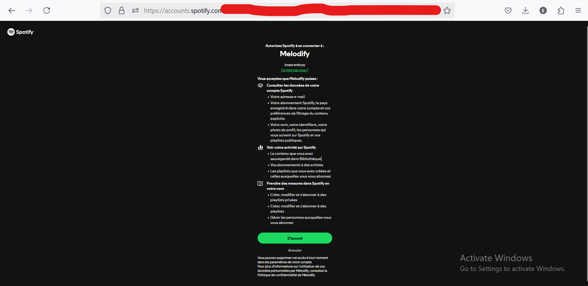
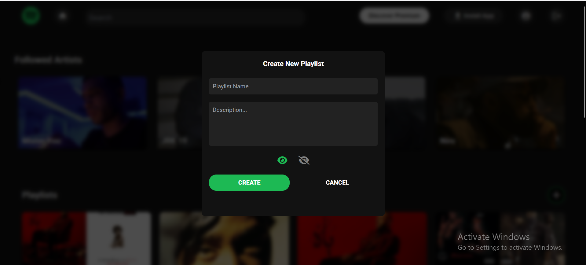
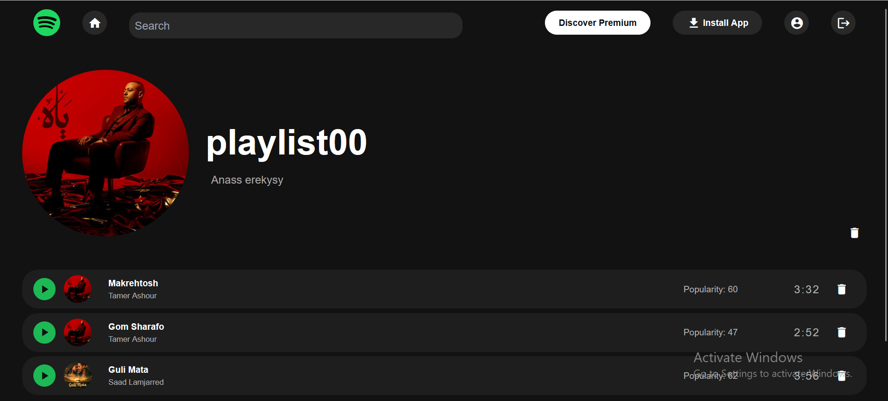
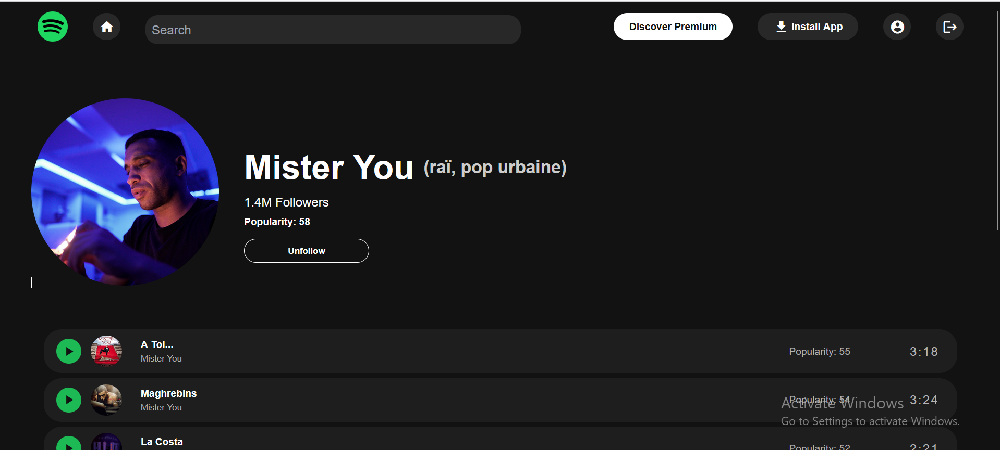

# Melodify

Melodify is a web application that interacts with Spotify's API, allowing users to access and manage their Spotify data through an intuitive interface

### Features

1. Spotify Login: 
    
    
    Users log in with their Spotify accounts via OAuth 2.0.

2. Home Dashboard: 
    
    
    
    Displays user data from Spotify, including playlists and favorite artists.

3. Playlist Management: Create, delete, add or remove a song to/from a playlists.

4. Artist Management: Follow and unfollow artists.

5. Search & Play Music: 
    
    Search for songs and listen to them (juste a little part).

6. User Profile: 
    
    View user profile details.

7. Playlist Details: 
    
    See playlist contents (songs, etc.).

8. Artist Details: 
    
    View artist information (followers, popularity, top 10 songs).

9. Play songs: 
    
    Play songs
## Technology Stack

1. Frontend: Angular 19

2. Backend: .NET 8 Web API

3. Database: SQL Server (Dockerized)

4. Authentication: OAuth 2.0 via Spotify

## Getting Started
Follow these steps to set up and run the application locally.


Prerequisites  
Ensure you have the following installed on your system:

1. Node.js (LTS recommended)

2. Angular CLI

3. .NET 8 SDK

5. Spotify Developer Account (to set up API credentials)

6. Clone the project to your local machine:

```bash
git clone https://github.com/AnassEREKYSY/Melodify.git
cd Melodify
```

Backend Setup

Navigate to the API directory:
```bash
cd server/API
```

Restore dependencies::
```bash
dotnet restore
```

Run the API:
```bash
dotnet run
```


Frontend Setup

Navigate to the client directory:
```bash
cd client/client
```

Install dependencies:
```bash
npm install
```

Run the Angular development server:
```bash
npm start 
or 
ng serve
```

Open your browser and go to:
```bash
http://localhost:4200/login
```


Environment Variables :
Create a .env file in the backend with the following variables:
```bash
SPOTIFY_CLIENT_ID=your_client_id
SPOTIFY_CLIENT_SECRET=your_client_secret
SPOTIFY_REDIRECT_URI=http://localhost:4200/callback
DATABASE_CONNECTION_STRING=your_sql_connection_string
```


Feel free to copy and paste this into your GitHub repository!

# Melodify